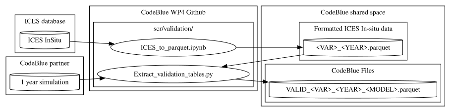

# Validation Tables

The **Validation Tables** contain paired model and observation values used for the evaluation of model performance against in-situ measurements.

## Purposes

**Validation Tables** address three main purposes:

1. Enable direct comparison between model outputs and observational data.
2. Support the computation of validation and skill assessment metrics.
3. Preserve the full granularity of validation data for future analyses, alternative skill metrics, and model weighting methodologies.

Rather than storing only aggregated validation statistics, the validation tables retain individual observation-model pairs, allowing validation methods to be refined and recomputed as needed.

## Format

**Validation Tables** are tabular files containing collocated observations and model values.

A tabular format is preferred to efficiently store the large number of observation-model pairs while preserving all information required for subsequent analyses.

Recommended filenames are structured as:

`VALID_<VARIABLE>_<YEAR>_<MODEL>.parquet`

## Observation sources

Validation observations are predefined and extracted from reference observational datasets.
The current validation workflow is based on queries to the ICES database. 
Observation datasets are therefore fixed a priori to ensure consistency across participating models. ICES data have been downloaded via: https://data.ices.dk/view-map. Dataset: Ocean hydrochemistry/Bottle and Low Resolution CTD Data.

## Variables

The validation tables currently include the following variables:

| Variable     | Unit       | Data Unit | Abr.|
| ------------ | ---------- | --------- | --- |
| Oxygen       | mmol.O₂/m³ | ml/l      | oxy |
| NOx          | mmol.N/m³  | µmol/l    | nox |
| NH₄          | mmol.N/m³  | µmol/l    | nh4 |
| PO₄          | mmol.P/m³  | µmol/l    | po4 |
| SiO          | mmol.Si/m³ | µmol/l    | sio |
| Chlorophyll  | mg Chl/m³  | µg/l      | chl |
| Temperature  | °C         | °C        | temp|
| Salinity     | psu        | psu       | sal |
| Secchi depth | m          | m         | sec?|

Additional variables may be included if required by specific validation exercises.

## Table structure

Each record corresponds to a single observation and its associated model value.

The expected table structure is:

| Model Name | Variable | Depth | Lon | Lat | Date | Obs. Value | Mod. Value |
| ---------- | -------- | ----- | --- | --- | ---- | ---------- | ---------- |
| ...        | ...      | ...   | ... | ... | ...  | ...        | ...        |

Where:

* **Model Name** identifies the model simulation.
* **Variable** identifies the observed quantity.
* **Depth** is the observation depth.
* **Lon** and **Lat** provide the observation location.
* **Date** corresponds to the observation timestamp.
* **Obs. Value** is the observed measurement.
* **Mod. Value** is the corresponding model value extracted at the same location, depth, and time.

## Methodological considerations

The validation tables are intended to preserve the highest possible level of detail while limiting storage requirements compared with full three-dimensional model outputs.

This approach enables:

* Computation of standard validation metrics.
* Development of alternative skill assessment methods.
* Recalculation of validation statistics without rerunning model simulations.
* Future refinement of model weighting and ensemble methodologies.

## Workflow and scripts

Related scripts are located in `./scr/validation/`  

The suggested workflow is as follows:  

1. Download ICES data: **DONE** for the all CodeBlue domain for the period 1960-2025 (_expect Secci depth for now_).   
2. Transform data into .parquet tabular files (1 file per variable per year): **DONE**. Everything is available in the Drive folder: `WP4/ICESData_for_validation`  
3. Create the `model.yaml` file (an example is available for `coherens.yaml`) and adapt following your model’s specifications.  
4. Execute the script `Extract_validation_table.py` to add the Mod.Value column to the parquet files and create the final **validation tables** (1 file per variable per year per model)

## Example file

Exemple of a validation table file (model: coherens, year: 2010, variable: chl) is available: `./scr/validation/VALID_chl_2010_coherens.parquet`  
Example of script if you want to play with your validation tables and see what the validation looks like, per regions (bias, RMSD, correlation, Taylor diagrams,...): `./scr/validation/Postproc_validation_tables.ipynb` 